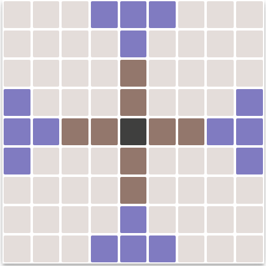

# Hnefatafl

*By [CJ](https://github.com/vssrcj)*

This project exposes platform agnostic API's for the Hnefatafl game using Google App Engine backed by Google Datastore.

It also includes a client (web) platform, that consumes some of the endpoints, to showcase the API's.

You can find the web app [here](https://hnefatafl-game.appspot.com)
and the API Explorer [here](https://hnefatafl-game.appspot.com/_ah/api/explorer)

[This](https://github.com/vssrcj/hnefatafl-game/blob/master/SETUP.md) is a simple guide to set this project up.

## How to play

* The starting board:

   

   Each cell's position is referenced as (column, row), meaning the top left cell is (0, 0)
   and the bottom right is (8, 8)

   All non-transparent cells are pieces on the board.  They have the following values:

   Piece | Colour | Value
   --- | --- | ---
   Attacker | Purple | 1
   Defender | Brown | 2
   King | Dark Brown | 3

* Goal:
   * In this version you as the player (the attacker) face off against an AI (the defender).
   * The goal for the defender is to get the king piece to any edge cell of the board.
   * The goal for the attacker is to capture the king piece.

* You may make one move per turn.  You can move any of your pieces across any amount of empty cells straight line.

* To capture an opposition piece, you must move your pieces on the opposite sides of an opponent's piece.
  *Note that if you move your piece in-between two opponent pieces, it won't be captured.*

* The defender can move the king piece, but it cannot participate in captures.

* To capture the king, you must surround it on four sides by attacking pieces, or on three sides if the fourth side is occupied by a defender piece.

## Scoring

Your score is calculated as by your win-percentage (total wins / (total wins + total losses)), and games played.
Players are ranked first by their win-percentage, and then by the least amounts of games played.

## API Endpoints

Most of the endpoints require OAuth 2 autherization.  It will request the user's name and email address.
If the user is not autherized, an exception will be thrown.
If no parameter is defined, it means it accepts none.
All the paths of the endpoints are the same as their names

* **new_game** *POST*
  * Creates a new game for the current user.
  * Returns the details of the newly created game:
    * ```key```           = datastore id
    * ```player_email```
    * ```board```         = the values of the board
    * ```state```         = the state of the game.  0: Player's turn. 1: AI's turn. 2: Player won. 3: AI won.

* **ai_move** *PUT*
  * Instructs the AI to make a move
  * Parameters:
    * ```game_key```      = datastore id
  * Returns the result of the AI move.
    * ```origin_value```  = the value of the piece that was moved
    * ```origin```        = the position of the piece that was moved
    * ```destination```   = the position of where the piece is moved to
    * ```captures```      = a list of cell positions that were captured
    * ```game_state```
  *  *An exception will be thrown if you're not the player of the game, if it's not the AI's turn, or if the game is over*

* **player_move** *PUT*
  * Makes a move
  * Parameters:
    * ```game_key```
    * ```origin_row```, ```origin_column``` = the column- and row index of the piece that must be moved
    * ```destination_row```, ```destination_column``` = the column- and row index of where the piece must be moved to
  * Returns the same data as **```ai_move```**
  * *An exception will be thrown if you're not the player of the game, if it's not the players's turn, or if the game is over*

* **player_games** *GET*
  * Gets all of the current player's games
  * Returns:
    * ```games``` = A list of entries that consist of:
      * ```key```
      * ```state```
      * ```player_email```
  *  *An exception will be thrown if you haven't created at least one game*

* **last_player_game** *GET*
  * Gets the last game the user played
  * Returns the same data as **```new_game```**
  * *An exception will be thrown if you haven't created at least one game*

* **player_rankings** *GET*
  * Gets all the players ordered by the best players first
  * Requires no autherization
  * Returns:
    * ```players``` = A list of entries that consist of:
      * ```email```
      * ```win_percentage```
      * ```games_played```

* **game_history** *GET*
  * Get the history of each move made for a game
  * Parameters:
    * ```game_key```
  * Returns:
    * ```results``` = A list of entries that consist of the same data as **```ai_move```** returned
  * *An exception will be thrown if you're not the player of the game, or if the game is not found*

* **cancel_gamey** *PUT*
  * Cancels a specific game
  * Parameters:
    * ```game_key```
  * Returns:
    * ```message``` = A message if the game was cancelled successfully
  * *An exception will be thrown if you're not the player of the game, or if the game is not found*

## CRON Job
 **https://hnefatafl-game.appspot.com/crons/send_reminder**

 If this link is accessed, it will send an email to all people whose turn it is to play of their latest game.  *Meaning the state of the game is 0*

## Future

* The CRON job will have more complex functionality
* The AI will use machine learning
* A player may be the defender or attacker
* Refining the Web App
